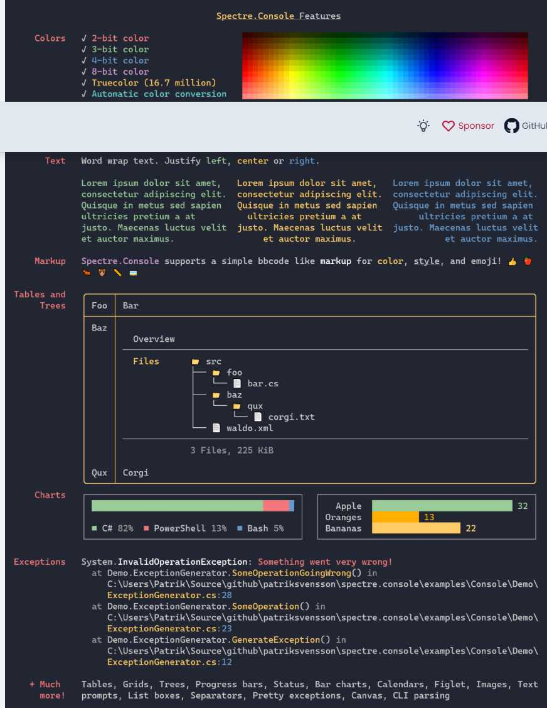

# Slide 1: What is Spectre.Console?

**Spectre.Console** is a .NET library that makes it easy to create beautiful, interactive, and cross-platform console applications.

---

**Key Features:**
- Rich text formatting with colors, styles, and emoji
- Widgets: tables, trees, panels, bar charts, calendars, grids, layouts, and more
- Live displays: progress bars, status spinners, and live-updating content
- User prompts: text input, single/multi-selection, confirmation, etc.
- Exception formatting with color-coded output
- Designed for testability and extensibility

> Inspired by the Python library [Rich](https://github.com/willmcgugan/rich), Spectre.Console brings modern CLI UI to .NET developers.

[Learn more at spectreconsole.net](https://spectreconsole.net)

---

[Next Slide: Why Use PwshSpectreConsole?](./slide2-why-use-pwshspectreconsole.md)
