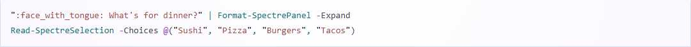

# Slide 2: Why Use PwshSpectreConsole?

**PwshSpectreConsole** brings the power and beauty of Spectre.Console to PowerShell scripts.

---

**Why it's cool for PowerShell devs:**
- Build visually stunning, interactive scripts with minimal effort
- Use Spectre.Console widgets natively in PowerShell
- Make your scripts more user-friendly and professional
- Great for dashboards, automation, and tools that need user input

> "A module to help you build pretty scripts with Spectre.Console in PowerShell."

[Explore the docs and gallery at pwshspectreconsole.com](https://pwshspectreconsole.com/)

---

[Next Slide: Widgets & Features](./slide3-widgets-and-features.md)
