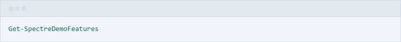

# Slide 3: Widgets & Features

**PwshSpectreConsole** gives you access to a huge range of widgets and formatting tools:

---

- **Panels**: Highlight important info
- **Tables**: Display structured data
- **Bar/Breakdown Charts**: Visualize numbers
- **Trees & Grids**: Organize complex data
- **Prompts**: Interactive selection, multi-select, text input, confirmation
- **Live Widgets**: Progress bars, status spinners, live-updating layouts
- **Exception & JSON formatting**: Beautiful error and data output

> All with color, emoji, and modern CLI style—directly in PowerShell!

---

[Next Slide: Real-World Use Cases](./slide4-real-world-use-cases.md)
