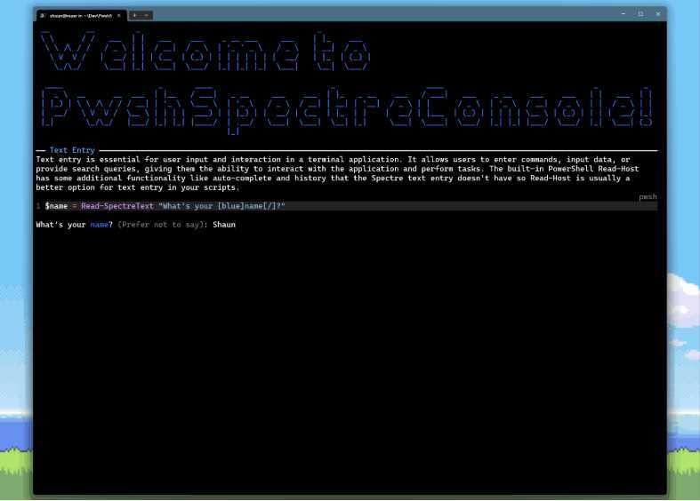

# Slide 5: Getting Started

**It’s easy to get started with PwshSpectreConsole!**

---

1. **Install the module:**
   ```powershell
   Install-Module PwshSpectreConsole -Scope CurrentUser
   ```
2. **Run the interactive demo:**
   ```powershell
   Start-SpectreDemo
   ```
3. **Explore the docs and try widgets in your scripts!**



> Make your PowerShell scripts beautiful, interactive, and fun!

[Full documentation and gallery at pwshspectreconsole.com](https://pwshspectreconsole.com/)

---

[Back to First Slide: What is Spectre.Console?](./slide1-what-is-spectre-console.md)
