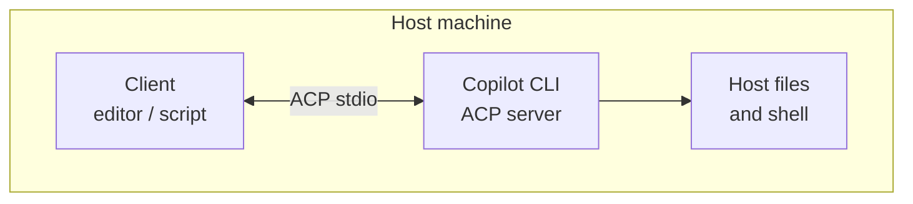

# Where does the work execute?

```mermaid
flowchart LR
  subgraph H[Host machine]
    direction LR
    C["Client<br/>editor / script"] <-->|ACP stdio| A["Copilot CLI<br/>ACP server"]
    A --> F["Host files<br/>and shell"]
  end
```

The client launches the ACP agent **on the host**.

The agent inherits its process permissions. A working directory is not an isolation boundary.

