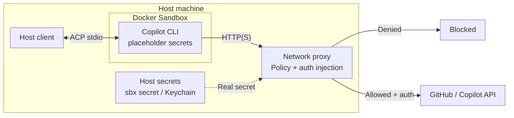

# Copilot in Docker Sandboxes

```mermaid
%%{init: {"flowchart": {"nodeSpacing": 20, "rankSpacing": 28, "padding": 10}}}%%
flowchart LR
  subgraph H[Host machine]
    direction LR
    C["Host client"]
    subgraph S[Docker Sandbox]
      A["Copilot CLI<br/>placeholder secrets"]
    end
    C <-->|"ACP stdio"| A
    A -->|"HTTP(S)"| P["Network proxy<br/>Policy + auth injection"]
    K["Host secrets<br/>sbx secret / Keychain"] -.->|"Real secret"| P
  end
  P -->|Denied| B[Blocked]
  P -->|"Allowed + auth"| E["GitHub / Copilot API"]
```

Proxy-managed secrets stay on the host; the agent sees a placeholder. Outbound TCP is controlled by network policy.

